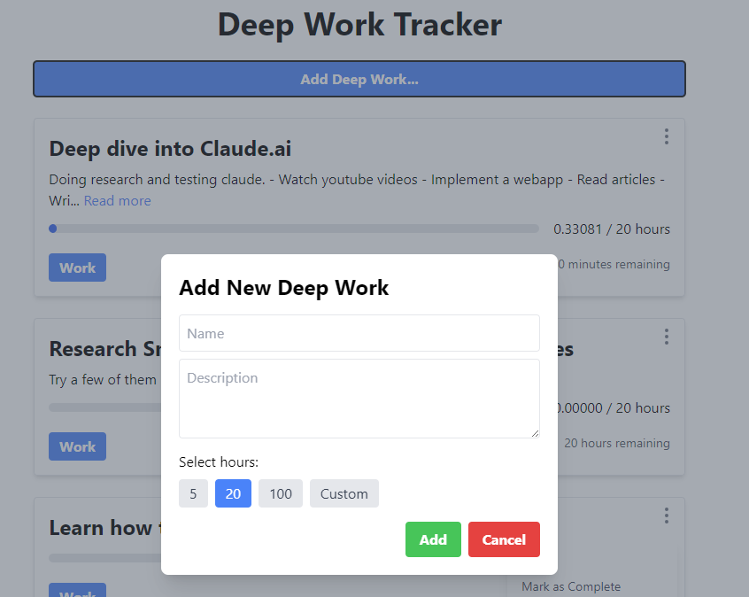

# Deep work tracker

This is a simple web app that helps you track your deep work sessions. It is inspired by the book "Deep Work" by Cal Newport and measuring work in hundreds of hours, as advocated by Alex Hormozi.

The initial version was generated 100% by prompting Claude.ai Sonnet 3.5 model. I spent around 4-6 hours on this initial version.

Features:
- Track deep work sessions



## Project setup
```
npm install
```

### Compiles and hot-reloads for development
```
npm run serve
```

### Compiles and minifies for production
```
npm run build
```

### Lints and fixes files
```
npm run lint
```

### Customize configuration
See [Configuration Reference](https://cli.vuejs.org/config/).
